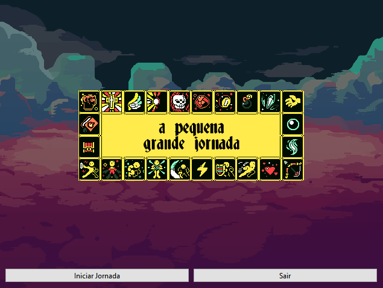
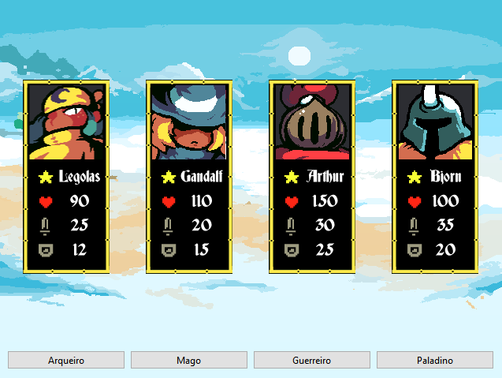
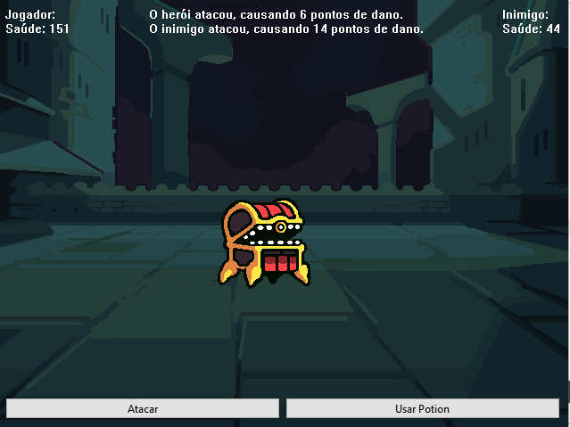
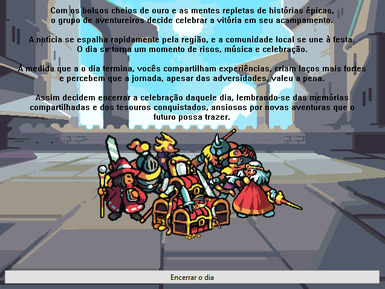

<table align="center"><tr><td align="center" width="9999"> 

# Repositório

<b> Instituto Federal de Educação, Ciência e Tecnologia de Santa Catarina 
Campus Florianópolis 
Departamento Acadêmico de Eletrônica 
Programação Orientada a Objetos</b>

*Jonathan Chrysostomo Cabral Bonette*

#

Um jogo de história de aventura baseado em texto que você dirige seu personagem para uma aventura meio épica. Sem regras, sem objetivo. Apenas aventura.

Projeto Fox é uma simulação pré-programada de fantasia baseada em texto com algumas possibilidades. Ao contrário da maioria dos jogos onde você experimenta mundos criados por designers de jogos, a ideia do Projeto Fox é o desensolvimento de um projeto em C++ juntamente com o software QT Creator para a disciplina de Programação Orientada a Objetos do IFSC.

</td></tr></table>
